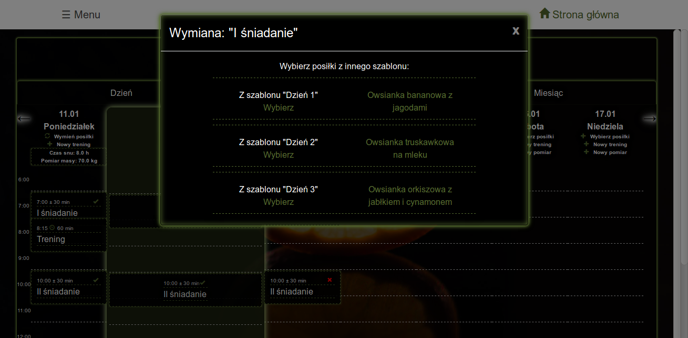

# Diethub

Web application for nutritionists and their patients - diet planning, tracking progress, creating statistics and ensuring communication to improve health

## Table of contents
* [Diethub](#grismor)
	* [Technologies](#technologies)
	* [Setup](#setup)
	* [Usage](#usage)
* [Project](#project)
	* [Introduction](#introduction)
	* [Description of the technologies used](#description-of-the-technologies-used)
	* [Presentation of the website functions](#presentation-of-the-website-functions)
	* [Access to the application](#access-to-the-application)

## Technologies
* Ruby 2.5.0
* Rails 5.2.4

## Setup
Clone this repo to your desktop. 

Configure your gemset (by creating a new gemset for this application with installed RVM - `rvm gemset create diethub`) and install gems by `bundle install`. 

Setup your Postgresql database by creating user, database and adding privileges on database to this user, then complete configuration in `config/database.yml` file. If database is ready, perform database migration by `rake db:migrate`.

## Usage

If setup is successed, you can run the application by `rails s` on your localhost and see a website at `localhost:3000`.

# Project

## Introduction
Using nutritionist advice is becoming more and more popular. The reason for this is, on the one hand, the increasing promotion of a healthy lifestyle, and on the other hand, the growing health problems of many people. Contrary to stereotypes, not only overweight people ask dietitians for help - their advice is also used by those who, for various reasons, are unable to maintain their correct weight, which is less or greater than normal, and have other health problems such as dermatological problems.

The work of a dietitian is not only about arranging meals for each day so that the patient gets the right number of calories and nutrients to achieve the set goal. It is also an analysis of the entire lifestyle, amount of exercise during the day, training, amount of sleep and time to rest.

Many mobile applications have been developed that allow you to plan and save meals. Such applications count calories as well as nutrients (protein, carbohydrates and fats). Often, they also have the option of recording training sessions.

Previously, there was no system that would allow nutritionists to supervise their patients. Traditionally, consultations take place with a selected frequency - from several weeks to several months. During this time, the patient can track his progress himself, but this is not in any way controlled by his doctor.

We have created an application that allows nutritionists to interact with their patients every day. This solution allows, on the one hand, for dietitians to establish a nutritional program for patients, and on the other hand, it allows patients to mark how they stick to the established diet and what progress they are making.

## Description of the technologies used

### Architectural model of MVC
Due to the numerous functional requirements for individual elements, such as products, dishes, users, the MVC architectural pattern was chosen, i.e. Model-View-Controller. It consists in designing views for specific models, the information flow is controlled by controllers. Internet models will include Users and meals. Specific views will be designed for them, such as user display, user list, dish display, food list and their ingredients with all information. By using appropriate methods in the controller, these views will be able to display the data requested by the user, such as statistics or schedule.

### Ruby on Rails framework

In 2004, Ruby on Rails made its debut among the frameworks used to create web applications. Websites like 37signals, GitHub, Twitter, Groupon have started using this technology. It is 100% open source, available under the MIT license - its use is free. It combines easy-to-use Ruby language and efficiency in creating (generating) websites. The Ruby on Rails framework will be used to create this web application, due to the transparency of models and their logic and ease of implementation.

### Modular design of the application

The files of the application created in the Ruby on Rails framework are divided into modules regarding their role in the system (e.g. models, controllers, views). Creating a system involves writing the source code of the methods for the appropriate models, controllers and other previously mentioned areas. Many templates for the files mentioned above are created automatically by using commands in the console. Detailed description of the implementation of some logic and visualization will be found later in this paper.

### Use of ready-made solutions

Ruby on Rails framework provides a lot of support for developers in the form of gems. These are ready-made modules written by other programmers (e.g. companies, special groups or amateurs). Each gem has its description and documentation, thanks to which its functions can be adapted to the needs of the written system. Below is a list of gems that will be useful for the functioning of the website in question:
rails
* puma - a gem that allows the operation of the puma server, which provides the basic functionalities of the website
* ass-rails– a gem that allows you to use the Sass language, which is then compiled into CSS language used as stylesheets
* pg - a gem that allows the use of a database. Provides connection to a PostgreSQL database, performs migration, data manipulation and reading from it
* devise - a gem that creates login, registration and logout mechanisms. To the appropriate class (in this case User - User), he adds appropriate attributes in the database, provides a ready controller and views with forms for login / logout / registration operations. It also has a built-in mechanism for sending e-mails.
bootstrap and bootstrap-glyphicons - gems that allow you to use ready-made style sheets and intuitive icons.

## Presentation of the website functions

### The navigation menu

For the Administrator:

For a dietitian:

For the patient:

### Users

List:

Profile:

Edit data:

### Ingredients for meals

List:

Details:

Edit data:

### Meals

List:

Details:

Edit data:

Editing ingredients:

Editing a recipe:
    

### Making a diet plan

Day templates:
    

Adding a new day template:
   

Adding a new time of day to a template:
   

Adding a new meal to the time of day:
   

### Schedule

Schedule Display:
   

Adding a template to a specific day:
   

Viewing details of the time of day (including whether the meal has been eaten):
   

Replacing a meal with a meal from a different template:
   

To add weight measurements and hours of sleep:
   

Adding workouts:
   

### Statistics
Two selected sample charts:

Body weight:
   

Calories:
   

### Messages

View all messages:
   

Writing a new message:
   

## Access to the application

A tool for developers, Heroku, was used for the operation of the website. It allows you to easily send written Ruby on Rails project files and run the application. The database is created and migrated automatically, and the appropriate gems are downloaded and installed.

The disadvantage of this solution is that it is a free tool and therefore has very limited resources. The website is “dormant” most of the time and “wakes up” only after access attempts. This results in a long session start time.

Link to a functioning application:
http://diethub-pro.herokuapp.com/

Below are the login details for three selected accounts.

Sample Administrator account:
- login: testowyadmin@mail.com
- password: c87554b2119e

Sample Dietician account:
- login: testowydietetyk@mail.com
- password: 665o4cbaaac6

Sample Patient's account:
- login: testowypacjent@mail.com
- password: ad5efada6475
